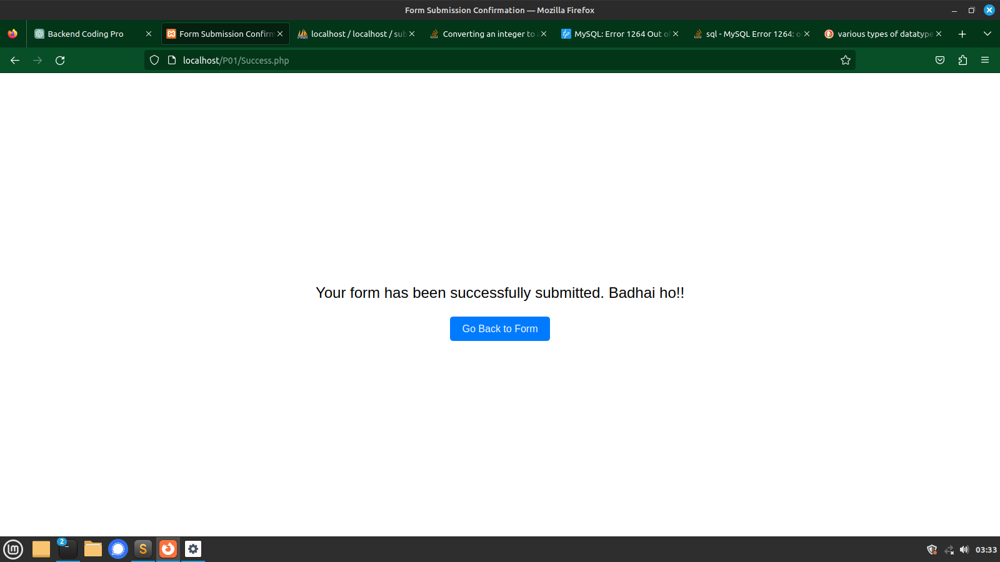

# MailFormSubmisson
This repository contains a simple and visually appealing HTML form with red error messages. The form is designed for contact us or feedback purposes and includes client-side validation with error messages. Additionally, a demo MySQL database setup is included to store form submissions.

## About project
It's a php-mysql Script where user fill form details.First, validation of form data using core PHP. It involve checking of all the form details  in respective format using preg_match(),strlen(),empty() and various other functions and after that removal of htmlspecialchar and other scripting part from input data.Then the form is sent to Admin through email using PHP functions mail() and it also record its detail in mysql server. This script does not include any JS part.<br>
It's fully Object Oriented code.
<h3> Glimpses</h3>



<h3> Technology used</h3>
HTML<br>
CSS<br>
PHP<br>
MySQL<br>

## Database Schema

Create the database and table using the following SQL schema:

```sql
create database if not exists submission;

create table if not exists inputData (
    name varchar(40) not null,
    email varchar(50) primary key,
    phone bigint not null,
    subject varchar(30),
    message TEXT,
    submission_date TIMESTAMP DEFAULT CURRENT_TIMESTAMP
);

